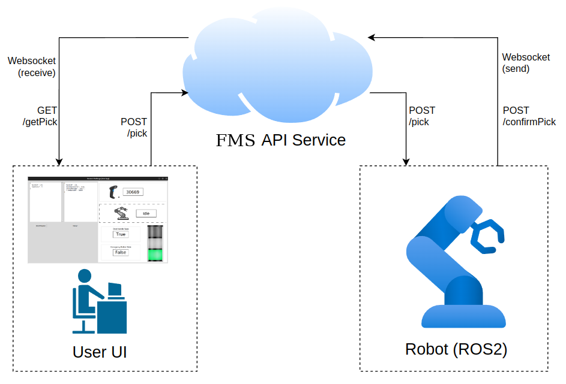
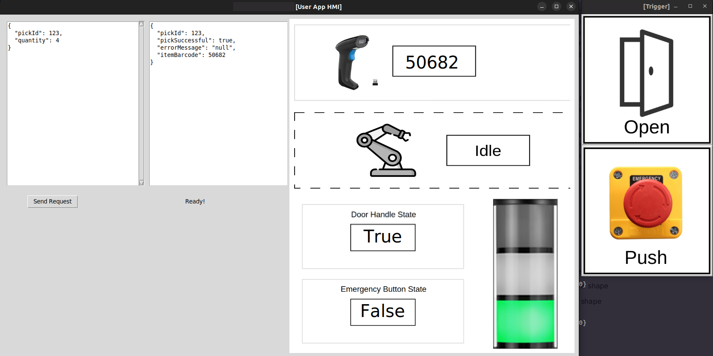
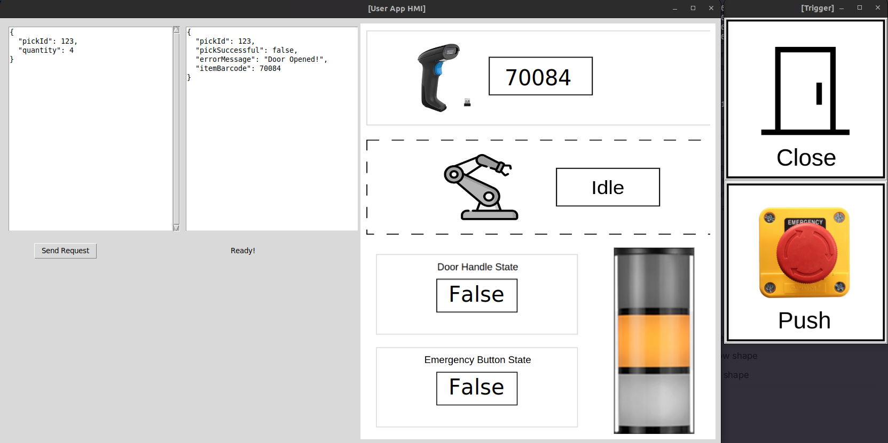
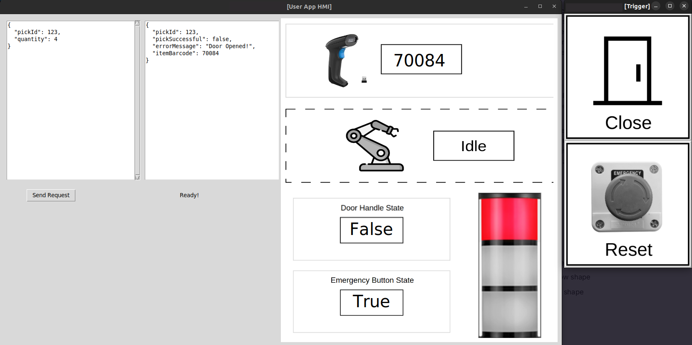

# Fleet Management System (FMS) Toy Simulator

## Installation

The solutions are entirely contained within Docker Compose. In this task I only provide the solution for Linux, and the execution can be simply performed by executing:

```latex
sh run.sh
```

After all execution is done, simply stop the Docker Compose by:

```latex
sh stop.sh
```

## Overall Architecture



The main program consists of three different parts. User UI, FMS, and the robotics system itself. In robotics deployment, the user will have access only to the FMS to handle robotics processes through an interactable UI, while the robot maintains communication and state exchange through the FMS as well, effectively avoiding direct connection and reducing possibilities of security risk. The user UI will need to send commands to FMS (8081) and then forward them to the robot (8080), thus safely executing the program. To maintain real-time state exchange and API updates, I utilize both REST API and WebSocket to handle user requests while also enabling real-time updates directly on the user UI.

- User UI
  
  The editable UI consists of two elements (a scroll panel on the left and a “Send Request” button below it), which are used for editing the JSON request and triggering the REST API request to the FMS server. The text panel on the right is for showing JSON responses, and all panels on the right side of the screen are meant only for showing updates (non-editable), so the state of the robot system is monitorable in real-time. I also added robot state to “simulate” the robot running sequence and check if it is correctly executed.
  To communicate, this UI will post `/pick` to the FMS server to trigger the process on the robot’s side. To retrieve the value, I made a triggering mechanism by a state change (boolean) through WebSocket to tell if there has been new data to retrieve and start getting the JSON response through `/getPick`. This maintains real-time updates upon the availability of the data while also avoiding pooling (endless loop) to acquire new states, thus improving performance as well. In case of a bad network connection, this method maintains reliability by caching the result and avoiding immediately getting new information until triggered. In the deployment scenario, this pipeline is mainly handled through MQTT, which has message queuing to handle reliability. For this case, I believe simply storing the most recent processing update is already sufficient. As an addition, the WebSocket data stream is only triggered when something gets updated, whether it is an API response, barcode read, robot status update, door handle status change, emergency button status change, or stacklight state update. Also, the REST API and WebSocket communication have both been operating asynchronously, enabling real-time and interactive updates on the UI.
- FMS (port: 8081)
  The role of this Fleet Management System is very straightforward. Basically, I utilize a FastAPI server with WebSocket compatibility to REST API, making both of them run flawlessly. Here are some endpoints that I utilized.
  - `/ws/updates`: Receives updates from the robot system, then forwards them to any connecting clients. This behaves just like a ROS publish-subscribe scenario or MQTT, but without them and in a more simplified fashion.
  - `/pick`: Receives a request for performing a picking sequence and directly forwards it to the same endpoint but hosted by the robot in port 8080.
  - `/confirmPick`: Receives the result from the “pick” task of the robot returning processing status and then stores it in the local variable.
  - `/getPick`: Return the cached processing result that has been stored within the local variable.
    All of the endpoints have been asynchronously implemented, effectively avoiding any potential slowdowns.
- Robot system (port: 8080)
  
  This is the overall pipeline, basically all the communication from inside to outside of the container is handled by `Robot Manager`, which maintains REST API exchange and WebSocket updates. All the task elements will be elaborated on in the next chapter, and only `Robot Manager` and `UI Manager` will be covered here, as they are outside of all the tasks.
  `Robot Manager` runs REST API and ROS in parallel, which actively respond to the request through REST API and WebSocket, while also obtaining state updates by subscribing to topics from different nodes. This node runs the :8080 API endpoint, which is elaborated on in the first task, so the user UI will have no direct communication with the robot.
  `UI Manager` is a simple UI that contains buttons for state update, it acts as a client for both `Door Handle Manager` and `Emergency Button Manager`, effectively triggering state update without the need to go through CLI. The states will also be directly reflected in the user UI since all the status updates in the `Robot Manager` get forwarded directly to all other WebSocket clients.

## Tasks Explanation

1. API Call Handler

   As elaborated before in the architecture, the handling of API is done by forwarding user requests from FMS to the robot. The user only needs to submit the JSON and make modifications to the values, and the task will be handled between FMS and the robot. I added JSON checking on the user UI side for analyzing the proper structuring, necessary key elements, and connection to the FMS to ensure proper communication and request body correctness. Here are some results during triggering of the operational state (green light), paused state (yellow light), and emergency state (red light).

   

   This is a sample request and response for each different state. The `pickId` in the JSON response follows the value submitted through the JSON request, while itemBarcode follows the latest barcode read. It can also be directly compared to the current state of barcode transferred through WebSocket on the side of the screen. The `pickSuccessful` is `true` when it is in an operational state but returns `false` upon opening the door or pressing the emergency button.

2. Scanner ROS2 Node

   This node generates a random 5-digit number as the barcode and updates it frequently every 3 seconds. The communication pipeline is as follows:

   - Subscribe `Int8` from `stack_light_state`, basically deciding to generate or not based on the state of the stack light node.
   - Publish `Int64` to `barcode_read_current` every 3 seconds. enabling update on `Robot Manager`
   - Service `Int64` to `barcode_scan` to be available upon request from `Robot Manager`

3. Door Handle ROS2 Node

   This node simply switches between `True` and `False` depending on the service trigger.

   - Service `Empty` to `switch_door_state` to be triggered upon request from `UI Manager`
   - Publish `Bool` to `door_handle_state` every 3 seconds. enabling update on `Robot Manager`

   The simulation of this task has already been done through the `UI Manager` interface. So there's no need to modify the running pipeline at all. One particularly interesting thing is that this state determines the stack-light state that affects the execution of the robot. So if the door is open (`False`), the robot simply does not move at all.

4. Emergency Button ROS2 Node

   This node provides selection between `True` or `False` depending on which service trigger to choose.

   - Service `Empty` to `enable_ebutton` to be triggered upon request from `UI Manager`
   - Service `Empty` to `reset_ebutton` to be triggered upon request from `UI Manager`
   - Publish `Bool` to `ebutton_state` every 0.1 seconds. enabling update on `Robot Manager`

   The simulation of this task has already been done through the `UI Manager` interface. So there's no need to modify the running pipeline at all. The same as before, this state determines the stack-light state that affects the execution of the robot. So if the button is pressed (`True`), the robot simply does not move at all until it is released/reset.

5. Stack-light ROS2 Node

   The stack determines the running state of the entire pipeline. It subscribes the state from `Door Handle` and `Emergency Button`, then determines and publishes the operational state.

   - Subscribe `Bool` from `door_handle_state`, checking if the door is open (False) or not (True).
   - Subscribe `Bool` from `ebutton_state`, checking if the button is pressed (True) or not (False).
   - Publish `Int8` to `stack_light_state` every 0.1 seconds, `Barcode Manager`, and `Robot Manager`.

   However, I believe this is slightly suboptimal since there is no way the node that only manages the lamp color determines the whole pipeline (the risk of accident is huge as this is one of the most important aspects). But putting it inside `Robot Manager` does not fit at all with the way this assignment works since there would be a subscription only in `Stack Light Manager`, and the original publishing state would be useless, which does not fit with the task description. But feel free to correct me if I am wrong; I would love to hear how this is actually conducted in production.

6. HMI

   The HMI design is utilized for the user UI and the trigger UI inside the ROS nodes. Here is how the state behaves during the operational state (green), paused state (yellow), and emergency state (red). Notice that the barcode read does not change when entering a paused or emergency state, which matches the implicit mention in Task 2.

   - Operational
     
   - Paused
     
   - Emergency
     

## References

- [FastAPI](https://fastapi.tiangolo.com/)
- [ROS2](https://docs.ros.org/en/humble/index.html)
- [Docker](https://www.docker.com/)
- [HttpX](https://www.python-httpx.org/)
- [Tkinter](https://docs.python.org/3/library/tkinter.html)
